# Kubernetes Deployment – Visual Documentation

---

## 1. Installing Docker

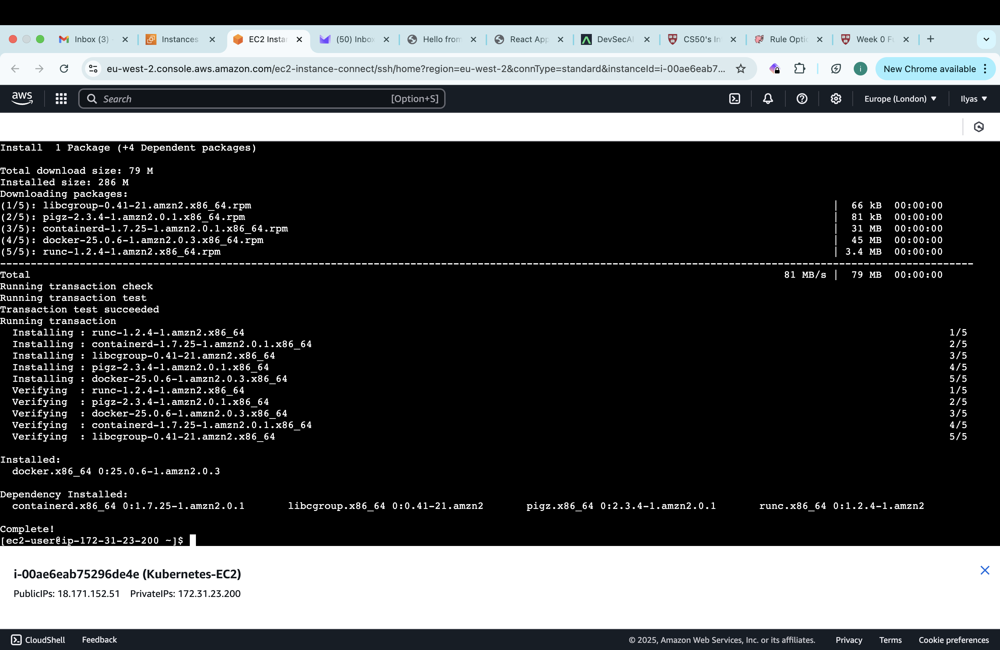

**Explanation:**  
This screenshot confirms that Docker has been successfully installed on my Amazon Linux 2 instance. Docker serves as the container runtime for our Kubernetes cluster, making it a fundamental prerequisite.

**Significance:**  
- **Foundation for Containerization:** Docker is critical for running containers, which are the building blocks the application.
- **Prerequisite for Minikube:** Minikube uses Docker to simulate a Kubernetes environment locally.

---

## 2. Installed kubectl

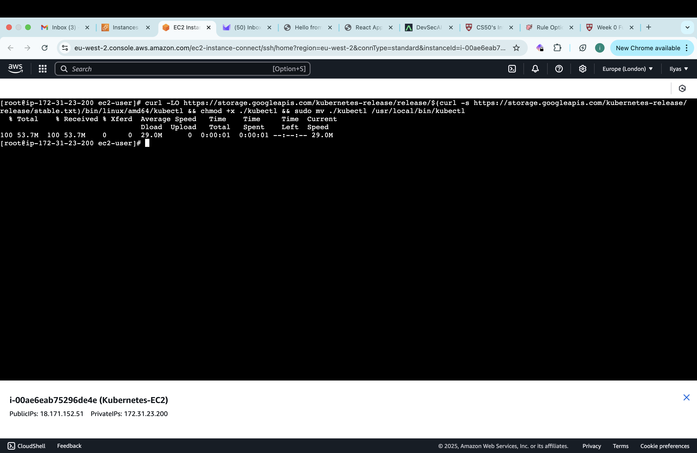

**Explanation:**  
This screenshot shows that `kubectl`, the Kubernetes command-line interface, has been successfully installed, which is essential for interacting with and managing our Kubernetes cluster.

**Significance:**  
- **Cluster Management:** Kubectl is used to deploy applications, inspect cluster resources, and perform administrative tasks.
- **Interface for Kubernetes Operations:** It provides a direct way to control and monitor our cluster.

---

## 3. Minikube Installed

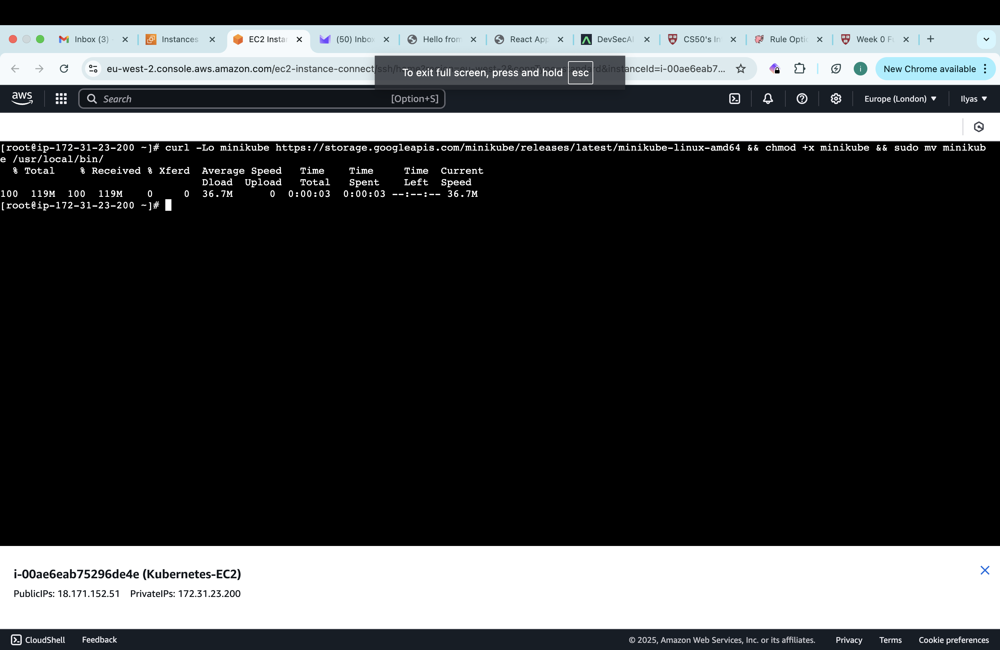

**Explanation:**  
This image verifies that Minikube is installed correctly. Minikube creates a local, single-node Kubernetes cluster, allowing us to simulate a production-like environment for development and testing without the overhead of managing a full-scale cluster.

**Significance:**  
- **Local Kubernetes Cluster:** Enables quick testing and experimentation.
- **Simplified Environment:** Facilitates learning and development by providing a lightweight Kubernetes setup.

---

## 4. Conntrack Installed

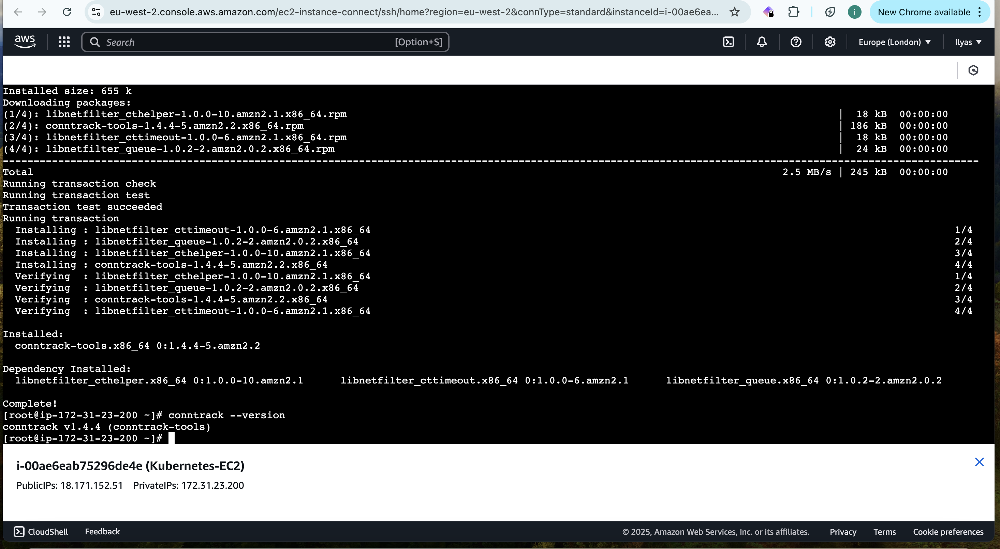

**Explanation:**  
This screenshot confirms the installation of `conntrack-tools`. Conntrack is essential for tracking and managing network connections between pods within the Kubernetes cluster, ensuring smooth internal communication.

**Significance:**  
- **Network Management:** Plays a key role in maintaining efficient network connectivity among pods.
- **Essential for Cluster Stability:** Helps in troubleshooting and optimizing network performance.

---

## 5. Deployment Created

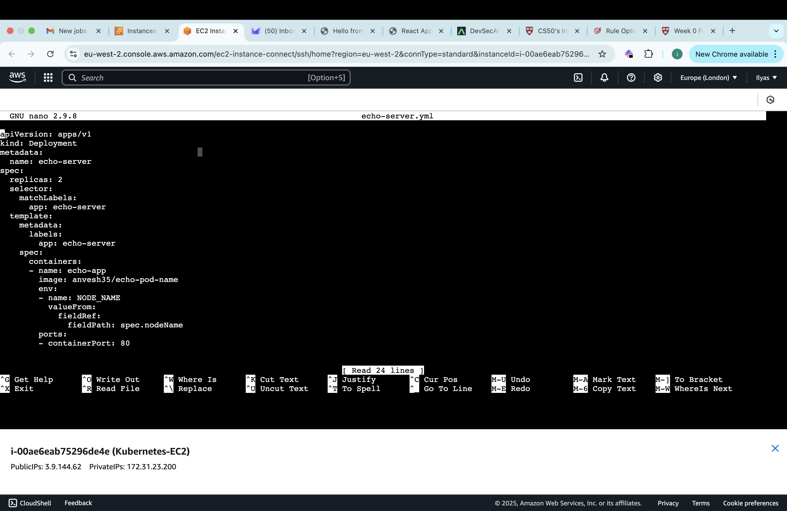

**Explanation:**  
This screenshot displays the creation of our initial Kubernetes deployment using a YAML configuration file. It shows how the Docker image (`anvesh35/echo-pod-name`) is deployed across the cluster. The deployment automates the creation and management of pods.

---

## 6. Deployment Updated (Deployment-2)

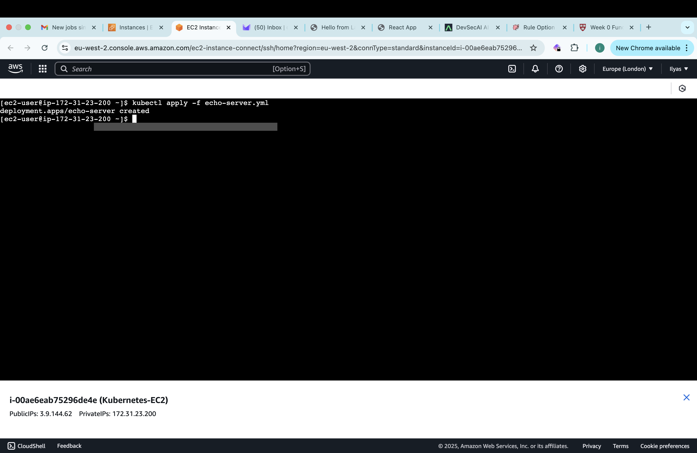

**Explanation:**  
In this screenshot, the .yml deployment we created is executed. 

---

## 7. Pods Running

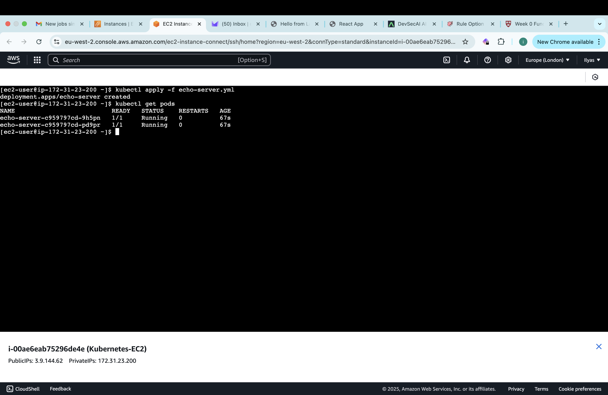

**Explanation:**  
This image captures the output of the `kubectl get pods` command, showing that the pods are actively running. It confirms that our deployment has successfully created the required pods and that they are operating as expected.

---

## 8. Service Created (NodePort Exposure)

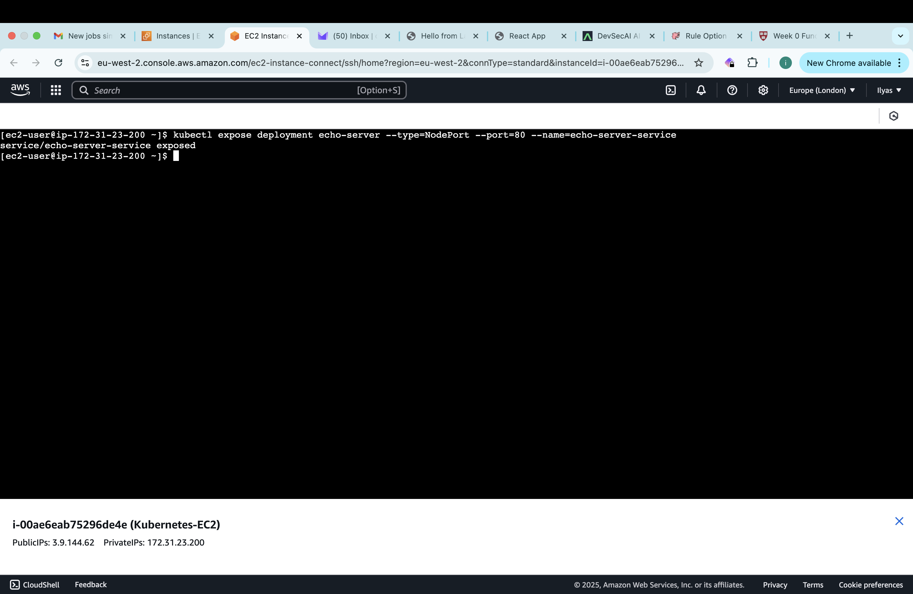

**Explanation:**  
This screenshot demonstrates the creation of a Kubernetes Service using the NodePort type. This service exposes the application externally by assigning a specific port on each node, making the application accessible from outside the cluster.

---

## 9. Local URL Displayed

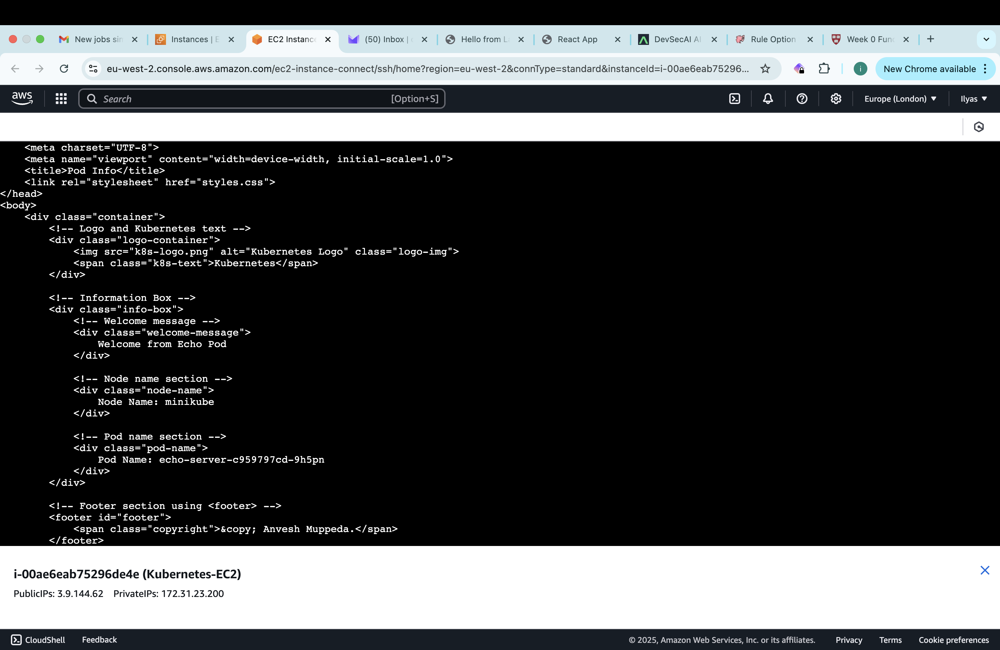

**Explanation:**  
This image shows the local URL output from the command `minikube service echo-server-service --url`. The URL provided by Minikube confirms that the service is correctly set up for external access.

---

## 10. Port Forwarding Established

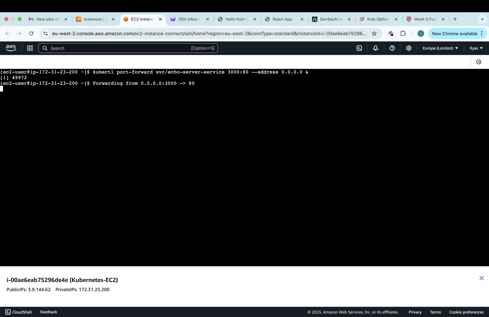

**Explanation:**  
This screenshot illustrates the execution of the `kubectl port-forward` command, which maps an external port on the EC2 instance (port 3000) to the pod’s internal port (port 80). Port forwarding is a useful technique for testing and debugging without altering service configurations.

---

## 11. Web App Access

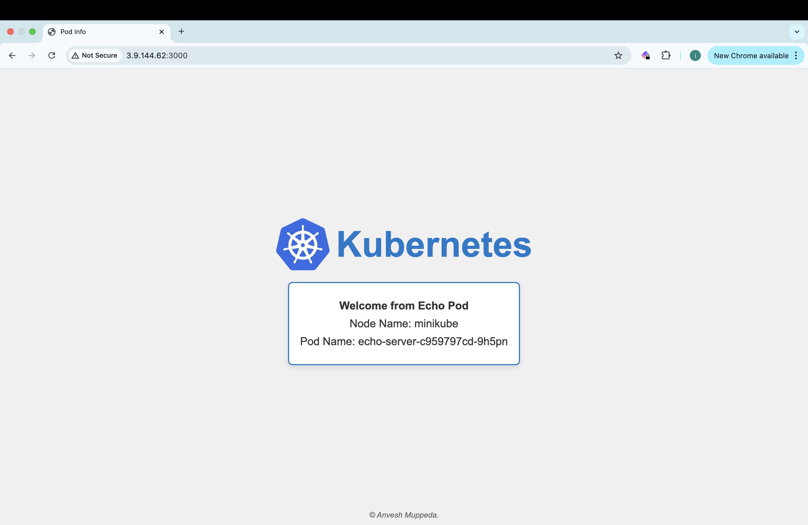

**Explanation:**  
The final screenshot shows the live web application in a browser, accessed via the EC2 public IP on the forwarded port. The application’s response (displaying the pod’s name) confirms that the end-to-end deployment—from containerization to external accessibility—is successful.
