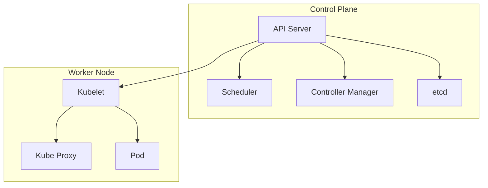

```mermaid
graph TD
    subgraph "Control Plane"
      APIServer[API Server]
      Scheduler[Scheduler]
      ControllerManager[Controller Manager]
      etcd[etcd]
    end

    subgraph "Worker Node"
      Kubelet[Kubelet]
      KubeProxy[Kube Proxy]
      Pod[Pod]
    end

    APIServer --> Scheduler
    APIServer --> ControllerManager
    APIServer --> etcd
    APIServer --> Kubelet
    Kubelet --> Pod
    Kubelet --> KubeProxy
```    